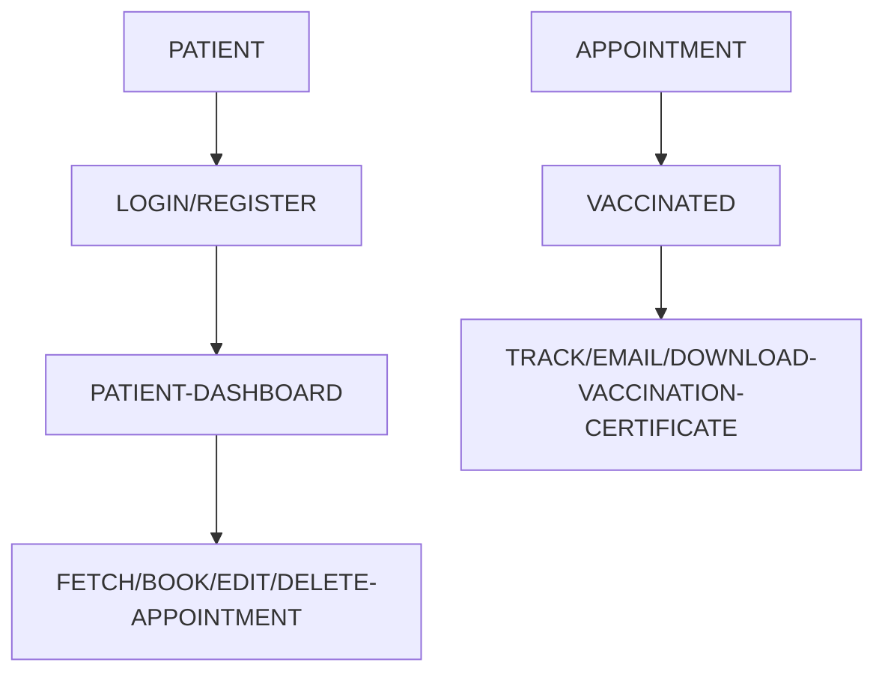
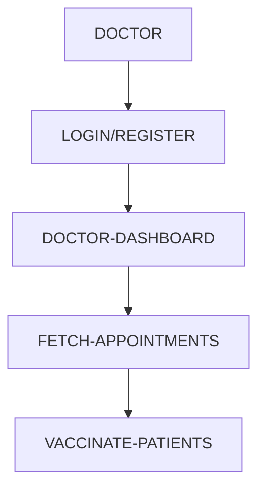
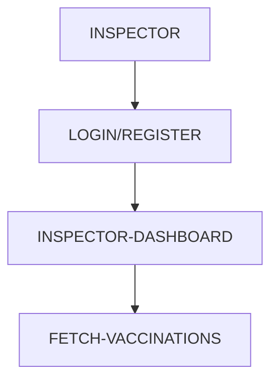

# Anand Vaccination System

[AVS](https://anand-vaccination-system.netlify.app/) is a robust MERN stack web app designed for precise disease vaccination with stringent validation to minimize errors. It also includes features like vaccination status tracking, certification issuance, and secure travel facilitation to maintain a safe environment.

## CONTENT
1. TECH STACK.
2. INSTALLATION.
3. OVERVIEW.
4. WORK FLOW.
5. VISUAL REPRESENTATION.

## TECH STACK

&nbsp;&nbsp;
&nbsp;&nbsp;
&nbsp;&nbsp; 
&nbsp;&nbsp;
&nbsp;&nbsp;
&nbsp;&nbsp;
&nbsp;&nbsp;
&nbsp;&nbsp;


| Technology Name |    Version     |
| :-------------: |:-------------: |
|      React      |    "^18.2.0"   |
|    Bootstrap    |    "^5.2.3"    |
| React Bootstrap |    "^2.7.4"    |
|      Axios      |    "^1.4.0"    |
|   React Icons   |    "^4.9.0"    |
|   React Qrcode  |    "^2.0.12"   |
|   React JWT     |    "^1.1.8"    |

## INSTALLATION

It is recommended to install `node version` >= `14.0.0+` as well as npm accordingly supporting to that node version.

To clone the code inside your local system use :

```
git clone https://github.com/anandpothraj/avs-frontend.git
```

## OVERVIEW
Features include:
- Single step solution for complete vaccination process.
- Consist Two step authenication system for high safety standards.
- Precision with High Validation.
- Doctor-Focused Dashboard.
- User-Friendly Patient Experience.
- Secure Certification.
  
## WORK FLOW
- There are three types of users in AVS :
  - Patient
  - Doctor
  - Inspector
- Features similar for all type of users :
  - Register or Login using two step user authenication system.
  - Edit User Details or User Credentials.
- Patient :
  - Filter and Track Vaccination Status.
  - Book, Fetch, Edit and Delete Appointments.
  - Preview, Email and Download Vaccination Certificate.
- Doctor :
  - Fetch Users and there Appointment details.
  - Add, update, fetch and delete vaccine details.
  - Vaccinate patients and update their vaccination details.
- Inspector :
  - Filter and Track Vaccination Status of patients.
  - Ensuring safe travel facilitation to maintain a safe environment.
 
## VISUAL REPRESENTATION
- Here is a simple flow chart for **Patient Vaccination Process** :

1. Patient Login, Register.


2. Patient Dashboard.


3. Book, Edit or Delete Appointment.


4. Fetch, Track, Email, Download Vaccination Certification.


- Here is a simple flow chart for **Doctor Vaccination Process** :

1. Doctor Login, Register.


2. Doctor Dashboard.

  - Fetch Appointments Dashboard.
    

  - Vaccines Info Dashboard.
    


3. Fetch Appointments.


4. Vaccinate Patients.


- Here is a simple flow chart for **Inspector Inspection Process** :


1. Inspector Login, Register.


2. Inspector Dashboard.


3. Filter and track vaccination status.

